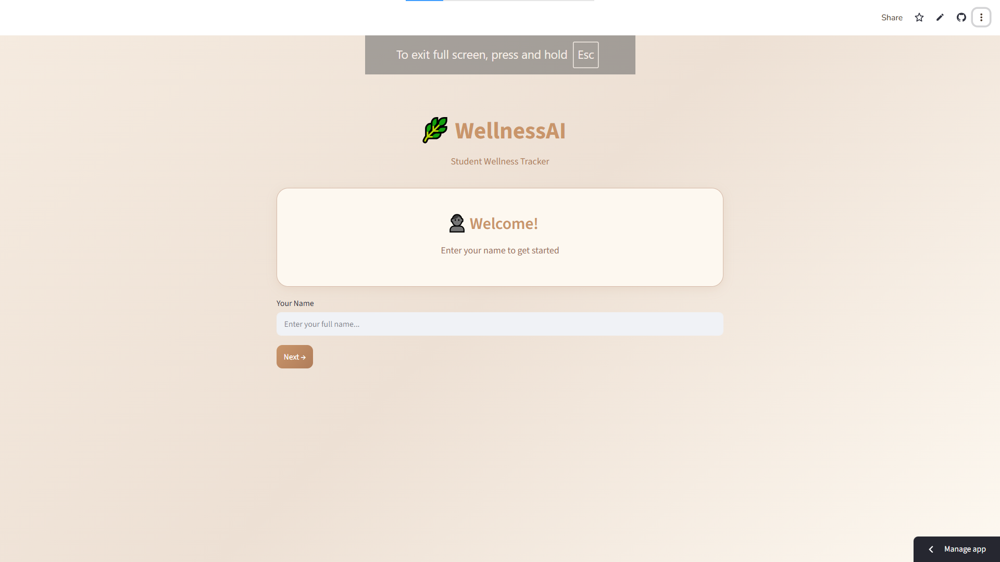
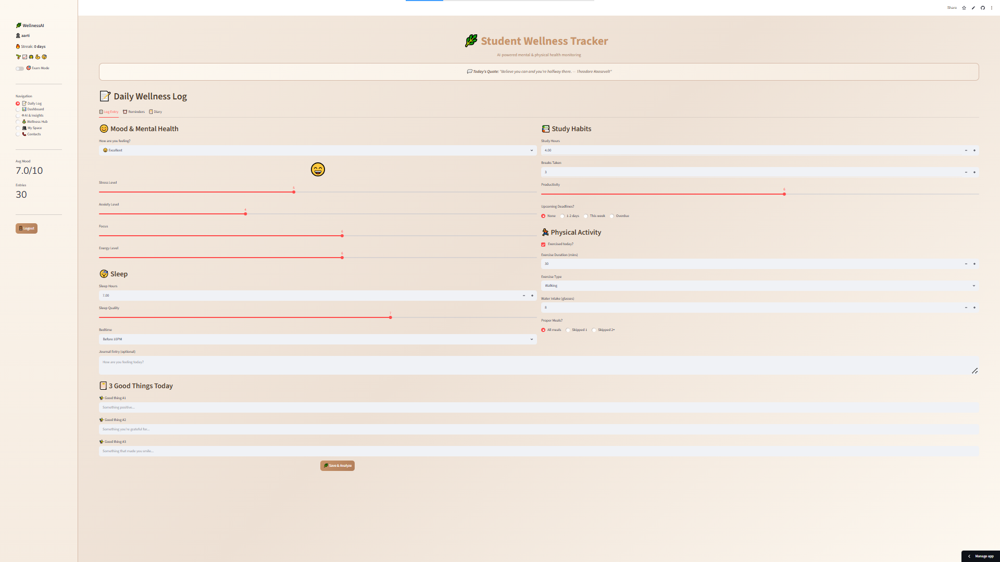
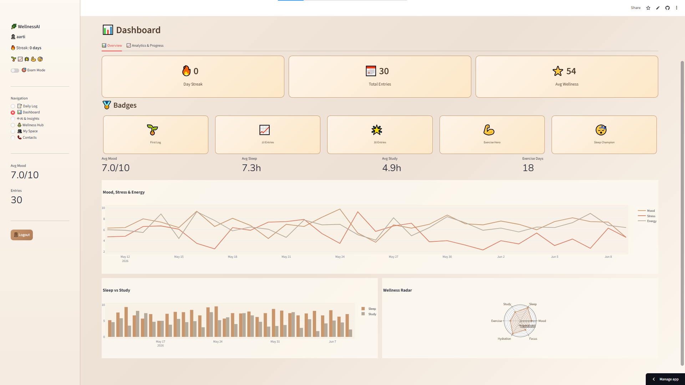
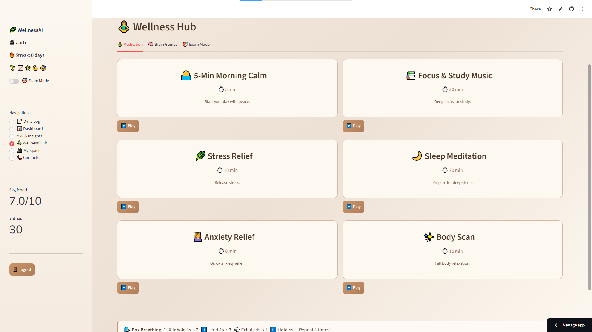

# 🌿 WellnessAI — Student Wellness Tracker


**An AI-powered web application that helps students track and improve their mental & physical wellness using Machine Learning.**

🚀 [Live Demo](https://wellness-tracker-fzdw8ca8gz5f6uxc4uahy2.streamlit.app) · 📂 [Report Bug](https://github.com/Aarti-1209/wellness-tracker/issues)

## 📸 Screenshots

### 🔐 Login Page


### 📝 Daily Wellness Log


### 📊 Dashboard


### 🤖 AI Insights


### 🧘 Wellness Hub


## ✨ Features

| Category | Features |
|----------|----------|
| 🔐 Authentication | Secure OTP-based login system |
| 📝 Daily Tracking | Mood, sleep, stress, study hours, exercise, hydration |
| 🤖 AI/ML | Gradient Boosting (wellness score) + Random Forest (burnout risk) |
| ⚠️ Safety | Automatic burnout detection + email alerts to trusted contacts |
| 📊 Analytics | Interactive dashboards, correlation heatmaps, trend analysis |
| 🧘 Wellness Hub | Meditation player, brain games, exam stress mode |
| 📔 Journaling | Gratitude diary, daily reflections |
| 🎯 Goals | Weekly goal setting with progress tracking |
| 🏅 Gamification | Streak system, achievement badges |
| 📄 Reports | Auto-generated PDF weekly wellness reports |

## 🛠️ Tech Stack

- Frontend: Streamlit
- Machine Learning: Scikit-learn (Gradient Boosting Regressor, Random Forest Classifier)
- Data Processing: Pandas, NumPy
- Visualization: Plotly
- PDF Generation: FPDF2
- Image Processing: Pillow
- Deployment: Streamlit Cloud
- Version Control: Git & GitHub

## 🚀 Live Demo

🔗 [Try WellnessAI Live](https://wellness-tracker-fzdw8ca8gz5f6uxc4uahy2.streamlit.app)

## ⚙️ Run Locally

```bash
git clone https://github.com/Aarti-1209/wellness-tracker.git
cd wellness-tracker
pip install -r requirements.txt
streamlit run app.py
```

Open your browser at http://localhost:8501

## 📁 Project Structure
wellness-tracker/

├── app.py

├── requirements.txt

├── utils/

│   ├── ml_models.py

│   ├── data_manager.py

│   └── recommendations.py

└── screenshots/

## 🧠 Machine Learning Models

| Model | Purpose |
|-------|---------|
| GradientBoostingRegressor | Predicts daily wellness score (0-100) |
| RandomForestClassifier | Classifies burnout risk (Low/Medium/High) |
| MinMaxScaler | Feature normalization |

## 👩‍💻 Author

Aarti Yadav
- GitHub: [@Aarti-1209](https://github.com/Aarti-1209)

⭐ If you found this project helpful, give it a star!
